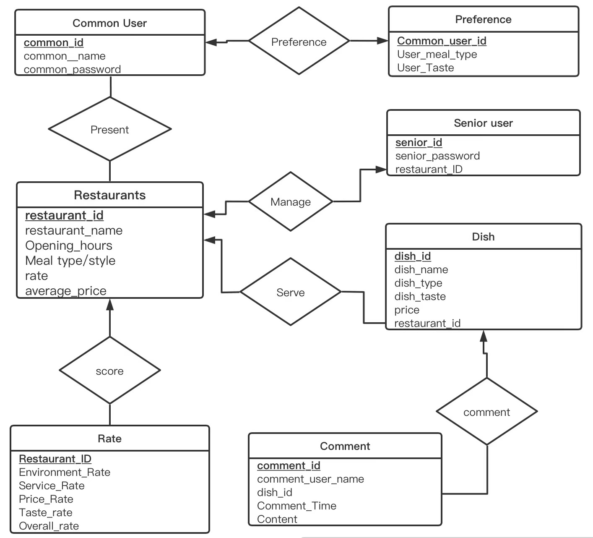

[](https://classroom.github.com/online_ide?assignment_repo_id=9503481&assignment_repo_type=AssignmentRepo)
# CSC3170 Course Project

## Project Overall Description

This is our implementation for the course project of CSC3170, 2022 Fall, CUHK(SZ). For details of the project, you can refer to [project-description.md](project-description.md). In this project, we will utilize what we learned in the lectures and tutorials in the course, and implement either one of the following major jobs:

<!-- Please fill in "x" to replace the blank space between "[]" to tick the todo item; it's ticked on the first one by default. -->

- [x] **Application with Database System(s)**
- [ ] **Implementation of a Database System**

## Team Members

Our team consists of the following members, listed in the table below (the team leader is shown in the first row, and is marked with 🚩 behind his/her name):

<!-- change the info below to be the real case -->

| Student ID | Student Name    | GitHub Account (in Email)  | GitHub Username                                |
| ---------- | --------------- | -------------------------- | ---------------------------------------------- |
| 120090835  | 周欣东 🚩       | 1196698984@qq.com          | [@2233-cheers](https://www.github.com/2233-cheers) |
| 120090524  | 金彦呈           | 120090524@link.cuhk.edu.cn | [@120090524](https://www.github.com/120090524) |
| 120090643  | 陈启旭           | 120090643@link.cuhk.edu.cn | [@bizu2001](https://www.github.com/bizu2001)   |
| 120040044  | 王钰涵           | camilla.y.wang@gmail.com   | [@Camilla-W](https://www.github.com/Camilla)   |
| 120090509  | 金一鑫           | 120090509@link.cuhk.edu.cn |[@huhuhahamaster](https://www.github.com/huhuhahamaster)|
| 119010529  | Yelike W Lukito | yelike0701@gmail.com       | [@YelikeWL](https://www.github.com/YelikeWL)   |

## Project Abstract

People’s expectations of food have changed from avoiding hunger to enjoying the taste. To better find the food that caters to personal preferences, our website provides detailed and up-to-date information about different restaurants and dishes. We also have recommendation and search mechanism to help users explore their favorites. Normal Users can rate different restaurants in terms of its environment, service, price and taste and see the overall rating. Moreover, they can share their comments with other normal users about any dish which restaurants currently offer. Senior users, the administrators of restaurants, can update their menus at any time by deleting or adding a dish. We hope this website can help people make more accessible and wiser choices of where to have a meal.


## Project Specification

<!-- You should remove the terms/sentence that is not necessary considering your option/branch/difficulty choice -->
This project aims at allowing registered users to record information and create content related to the canteens and foods provided by CUHKSZ. The website is a platform to find ratings and reviews of canteens and foods. 
Below are the significant concepts and corresponding settings: 

**User**: The one who receives the service from the applications. The registered user can review the information on dishes provided by different canteens. The users can also add comments, have his/hers average spending recorded, and grade the quality of the dishes he or her has ordered.

**Senior User**: The administrator of a specific canteen. Information about his restaurant id should be included.

**Restaurant**: provide various types of dishes. Each restaurant has its ID, name, location, providing dishes, and its average price for each person (or other analyzed information), and the average rate of one restaurant. 

**Rate**: records storing the users' rating on the hygiene and service of the restaurants.

**Dish**: every restaurant provides various types of dishes. Every dish has its corresponding restaurant (providing the dish), its name, its type(how it is cooked, for example, fried or boiled), price, taste( special features that might cause unpleasant feelings for certain groups of people, for example, spicy or not）and its ordered time. 

**Comments**: records of comments added by the user for specific dishes. This should include the comment's actual content, the time the comment is added, the user’s ID of comment, and its corresponding dish’s restaurant ID and name.

After thorough discussion, our team made the choice and the specification information is listed below:

- Our option choice is: **Option 2**
- Our branch choice is: **Branch 1**
- The difficulty level is: **Normal**
 

## How To Run
1. Setting up Environment
We have several libraries used in our project. Thus to run the website on your PC, you need to run:
```
$ pip install -r requirements.txt
```
or install the packages manually.

2. Database Configuration
Our program database is set up to connect with a mysql account whose password is "password" (without the quotation mark). Therefore, you will need to either modify the password on the code to suit yours, or make a mysql account with "password" as its password. Finally, create a database named "3170project" (without the quotation mark).

3. Run The Program
Enter the commands below in the terminal:
```
$ set FLASK_APP = app.py
$ flask run
```
Make sure that you run the program under the same directory as app.py.

## Accounts
It is easy to register and log in as a common user. While for senior user, we have pre-setted different accounts for all of the restaurants available. You can use the accounts below to try it out:

**Restaurant 1**: 
- Username: r1
- Password: 123456

**Restaurant 2**: 
- Username: r2
- Password: 123456

**Restaurant 3**: 
- Username: r3
- Password: 123456

**Restaurant 4**: 
- Username: r4
- Password: 123456


 ## ER diagram 


**Common User**: The common users who receive service from this application. This table stores the username and password collected from front-end and the ID is automatically generated. 

**Preference**: Users’ information about the dietary preference. Application will recommend some dishes in the main interface according to users’ choices. 

**Senior User**: The administrator of a specific restaurant. Information about his restaurant id should be included.

**Restaurants**: provide various types of dishes. Each restaurant has its ID, name, opening hours, meal style, rate and average price. 

**Rate**: records the rate in several aspects for each restaurant.

**Dish**: Every restaurant provides various types of dishes. Every dish has its corresponding restaurant, its name, its ID, its price, and food’s taste and type.  

**Comments**: records of comments added by the user for specific dishes. This should include the comment's actual content, the time the comment is added, the user's name of comment, and its corresponding dish's ID.


## Program Design
The task of our team project is to develop an online rating and browsing website that includes several restaurants. The web page was constructed under Flask framework and programmed with python language. The front end used html language, CSS and java script. This website includes two kinds of modes: the common user mode and the senior user mode.
The program will provide the following service:
1. For a new user: create an account (only available for common user). After that, they can set their preference. Then they can enter their main page (The rest parts are the same as the normal user)

2. For a normal user who already has their accounts (their preference has been set previously): They can log in to their account and enter the main page.
    After all, the user can choose from one of the three branches:
    1. Choose one of the links to the four restaurants and enter the restaurant’s main page. User then can view all the dishes provided and descriptions of the restaurant. They can click on one of the dishes and view the comments of others or add the user’s comment.
    2. Check the dishes recommended by the system on the right side of the main page
    3. Use the search box to search for the dishes you want and enter the corresponding dish page. The users are then free to view or add comments of the dish

3. For a senior user, they can enter ‘senior user’ mode and log in to senior account. They are then free to enter the main page of the user’s restaurant to add or delete dishes. Editing of dishes includes submitting or modifying prices, pictures and descriptions of dishes


## File structure
**Back-end**
- [app.py](3170project/app.py): The main back-end program, including database establishment, data storage, management, and interaction with the front pages, having several functions and data. 

**Front-end**

In [templates](3170project/templates),
- normal_login.html: The login page for common users which provides the function of reading and checking the username and password. 
- create_account.html: The common registry page for common users which provides the function of recording new user’s information and check whether re-entered password is the same. 
- senior_login.html: The login page for senior users, including the function of reading and checking the username and password. 
- preference.html: The page for user preference setting after registering which provides options for meal tastes and types. 
- info.html: The main interface for users, including search module, dish recommendation module and restaurant module. 
- normal_r(1-4).html: The menu interface of each restaurant which presents several dishes and restaurant information. 
- senior_r(1-4).html: The management interface for senior users where managers can delete dishes and add new dishes’ information (containing image uploading).
- comment.html: The detailed dish page for common user, including dish information, comment-adding module and comment presenting part. 

In [css](3170project/static/css),
- login_css.css and resta_css.css are used for page decoration.

**Other materials**
- In [static](3170project/static), [images](3170project/static/images) contains 6 pictures, 4 restaurants photos used in normal/senior r(1-4).html, 1 logo and 1 login background picture used in normal_login/senior_login/create_account.html. [uploads](3170project/static/uploads)  contains 32 initial meals pictures which can collect new photos uploaded by senior users. 
- [ER_Diagram.png](ER_Diagram.png): The image file of ER diagram.
- [presentation_sildes.pdf](presentation_slides.pdf): The PDF version of presentation sildes.


## Functionality Implementation
Following is the core function we have realized in our program
1. **Logging in**: (normal_login.html, senior_login.html)
- Set up a form to store user information of the common user and senior user, such as usernames, passwords, and any other relevant details. We use SQLAlchemy to interact with the database in our Flask application.
- Set up routes to handle the login process:
- Implement a function to authenticate the user's credentials. This can be as simple as checking if the username and password match what is stored in the previous form.
- If the authentication is successful, set up a form for the user to store their login status. (The form should be updated whenever a new user is using the application)
- Show different content depending on the user's identity. For example, for a senior user, the program will lead it to the template of the main page of the restaurant.

2. **Creating the account**: (create_account.html)
- Implement a function to create a new account in the database. This can involve inserting a new record into the common_user table. In order to prevent the user name from repeating or the user enters the wrong password, we design the corresponding detection logic, which improves the robustness of the system.
- If the account creation is successful, the program set up a session for the user to redirect them to the preference page. They need to set their preferences, which are then sent to the back end to select the recommended dishes for that user

3. **Recommendation mechanism**: (on info.html)
- The back end scores all dishes according to user preferences. It iterates through the dishes, retrieving the style and flavor of each dish in the database, adding two points for style matches and one point for flavor matches. Finally, back end sends the information of the three dishes with the highest total score to the front end. They will be displayed on the normal user main page (info.html) after matching pictures.

4. **Search mechanism**: (on info.html)
- This feature is mainly implemented on the front end and uses java- script to handle fuzzy search. The user enters the fragment of the dish name in the search bar of the main page to find the relevant- dishes at the bottom. Click on the menu and you will enter the dish page(comment.html)

5. **Add rating to the restaurant. Add comment and display comment**: (normal_r1(r1-r4).html->comment.html)
- There are display boxes of four restaurants in the main page. Click to enter the main page of the four restaurants (normal.html). In the main page, you can see the introduction of the restaurant and the list of all dishes in the restaurant. You can rate the restaurant here as well. Click the list of dishes to enter the relevant dish page (comment.html).
- On the left side of the dish page are other user reviews of the menu, including username, content and date of evaluation. Users can enter their comments in the comments field and submit them, and the information is passed to the back end, where it is saved in the comment table of the database and refreshed on the left.

6. **Dish management**: add or delete a dish: (senior_r1(r1_r4).html, each for one restaurant)           
- This feature is only available to senior accounts at specified restaurant. After logging in using the senior account, managers will straightly come to senior_r(1-4).html which are the edited interface for corresponding restaurant. The entire page is similar to normal_r(1-4), except for the add module and multiple delete buttons. 
- In the lower left corner of the page is the add module which manager need to type the new dish name, description and upload the pictures. After submission, text information will be saved to the database and the image will be upload to the “uploads” folder while storing the path to database. In this case, new dishes can be displayed. 
- On the right side of the page are the existing dishes with “delete” button on each one. If manager click selected dish’s delete button, the information will also be removed from “dishes” table. Thus, expurgated dishes will not be displayed anymore. 


## Difficulties
1. The most significant difficulty we have encountered is that, during our application development, three of our members contracted covid19 and had very severe symptoms. We prioritize the health and well-being of your team members and do our best to support those who have been affected by it. We communicate online with our team and about the situation and any potential delays or changes in our project plan. By keeping everyone informed and involved, we work together to find ways to overcome the obstacles by redistributing the task.
2. Most of our team is not familiar with Flask and front-end development, we invest some time in learning and training in these areas through tutorials, documentation, and online courses. When we encountered difficult problems in development, we actively exchanged ideas and solutions, which benefited us a lot.


## Contribution of each teammate
- Xindong Zhou(周欣东): Team Leader, work coordination (integration between back-end and front-end), back-end development (form submission, parameter passing), report

- Yancheng Jin(金彦呈): back-end development (recommendation mechanism, rating system), work coordination, report

- Qixu Chen(陈启旭): Schedule management, back-end development (main logic), anaphase testing, report

- Yuhang Wang(王钰涵): web front-end development（picture transporting, storing and displaying; page decoration), anaphase testing, presentation

- Yixin Jin(金一鑫): page decoration, web front-end development (fuzzy search)

- Yelike W Lukito: page decoration, back-end development, presentation

## Presentation Slides
[Presentation Slides](presentation_slides.pdf)

## Presentation Video
[https://cuhko365-my.sharepoint.com/:v:/g/personal/119010529_link_cuhk_edu_cn/ETo4RxJ_dBBOsfau4Ocgvu8BrKr-b59kgajuVVd9Lc0aDQ?e=QuVt5c](https://cuhko365-my.sharepoint.com/:v:/g/personal/119010529_link_cuhk_edu_cn/ERl8VNz-Qg9Cl3Lb_3h8fBsBq9bACD4LI_PG9rBKmPjhFA?e=jEdVOs)
